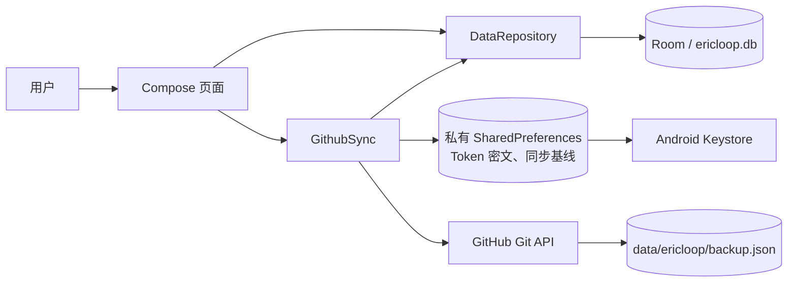
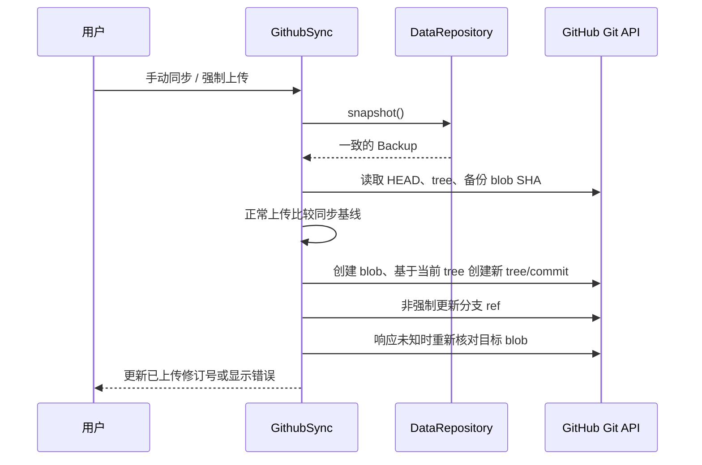

# EricLoop 架构设计

状态：按当前 `feat/ericloop-v1` 实现记录，更新于 2026-09-30。产品规则见 [spec.md](spec.md)，具体流程和接口见 [detailed-design.md](detailed-design.md)，实施与验证状态见 [implementation.md](implementation.md)。本文描述已实现结构；云端成功路径的验证状态以实施记录为准。

## 目标和边界

EricLoop 是仅在当前连接的 Android 设备上运行的个人想法、计划与进展记录应用。编辑与查询以手机本地数据为准，GitHub 是用户手动操作的整份数据备份目标。电脑端不参与查询和分析。首版没有服务端、账号系统、自动同步、跨设备实时合并、永久删除和历史版本恢复。构建目标由 `app/build.gradle.kts` 定义：Kotlin、Jetpack Compose / Material 3、Room、Kotlin Serialization、OkHttp，`minSdk=35`。应用版本的唯一来源是仓库根目录 `version.properties`，构建时写入 Android 的 `versionName`/`versionCode` 和设置页版本显示；每个应用修改节点提交前递增补丁版本及内部代码。它独立于 Room schema 与备份格式版本。

质量目标是本地操作即时可见、记录与历史保持一致、失败的下载/恢复不破坏手机数据，以及上传时只改动仓库中的 `data/ericloop/backup.json`。备份和 GitHub 仓库按用户约定为公开明文；Token 只保存在手机端加密设置中。

## 系统上下文与分层

`MainActivity` 通过 `LoopViewModel` 在 Activity 生命周期内持有一个 `DataRepository` 和一个 `GithubSync`。`EricLoopApp` 订阅两者的 `StateFlow`；页面只提交用户动作，不直接读写 Room 或网络。当前是单 `app` 模块，包分为 `ui`、`data`、`sync`。路由由 `ui/App.kt` 的字符串状态和 `rememberSaveable` 管理，没有 Navigation 组件或依赖注入框架。`LoopViewModel` 负责配置变化时保留仓库与同步对象；进程重启后从 Room 和私有设置重新初始化。

依赖方向为 `ui → data`、`ui → sync → data`。`data` 不依赖 UI 或 GitHub；同步层通过仓库的 `snapshot()` 和 `restoreBackup()` 访问数据。这使 GitHub 请求不能直接修改页面状态或数据库表。

## 数据所有权与持久化

`Backup` 是内存中的完整数据集与备份交换格式，含 `schemaVersion=1`、`datasetId`、`revision`、`exportedAt`、记录、标签、打卡和事件。记录及标签通过稳定 ID 关联。`datasetId` 标识整份数据集，`revision` 与事件序号同步增长；`exportedAt` 是导出时间，不代表业务数据更新。

Room 数据库包含 `records`、`tags`、`checkins`、`events` 和单行 `metadata`。各业务表保存 ID 和序列化 JSON payload；事件表另外保存序号与记录 ID；`metadata` 保存不含四组列表的备份元数据。这样的结构使普通写入只更新受影响的对象、追加事件和元数据；查询页目前仍在内存中读取完整数据集并筛选。首次启动在一个事务中建立五个预定义标签。已有数据库加载时组装 `Backup` 并严格校验，包括事件重放。

所有本地修改经 `DataRepository` 的 `Mutex` 串行化。仓库先计算下一份数据，校验增量事件，再用 Room 事务一起写入实体、事件与修订号，成功后发布新的 `StateFlow`。无实际变化不追加事件。恢复是独立路径：全量校验云端备份，先写应用私有目录中的 `pre-restore-*.json` 安全副本，再在 Room 事务内替换全部数据，最后发布新状态。安全副本目前没有 UI 恢复入口或自动清理策略。

## 历史与查询

每次有效操作产生一条 `HistoryEvent`，带单调序号、操作时间、记录 ID（标签管理事件为空）、操作类型及前后 JSON 快照。记录快照还包含当时关联的标签快照。加载和云端恢复使用事件重放核对最终对象；普通修改只验证最新增量。删除使用 `deletedAt`，记录、打卡和历史仍保留。标签管理事件属于数据集历史，但当前“变更”界面是按想法/计划标题进入单条记录 Graph，不展示没有记录 ID 的标签管理事件。

记录列表、标签计数、筛选和变更目录基于已经加载到内存的 `Backup` 计算。Compose `LazyColumn` 负责可见行渲染；它不是数据库分页。随着记录和事件持续增加，启动校验、内存占用、筛选耗时及备份大小都会增长。当前备份/上传上限为 20 MiB，GitHub API JSON 响应限制为 32 MiB；首版未做大规模性能验收。

## GitHub 备份边界

同步设置默认指向 `shensunbo/EricLoop` 的 `main` 分支。手机只对 GitHub Git API 请求分支引用、提交/树、目标路径下的 blob，并在远端最新树上创建一个仅替换 `data/ericloop/backup.json` 的新树和提交；不克隆整个仓库，也不改动其他文件。仓库代码变化但备份 blob 未变时，正常上传可以继续。新提交通过非强制 ref 更新接到最新分支，最多处理三次并发变更；“强制上传”仅跳过备份内容冲突检查，不执行 Git force push。

本地私有 `SharedPreferences` 保存连接参数、加密 Token、上次确认的云端 blob SHA、已上传修订号/数据集 ID 和成功时间。Token 使用 Android Keystore AES-GCM 密钥加密，不进入 `Backup`、Room 业务表、历史快照或 Git 仓库。同步操作另有 `Mutex`，上传从仓库取得一致快照；上传期间后续本地修改仍会显示待上传。下载先校验文件大小、blob SHA、JSON 必需字段、引用和历史，再给用户预览。用户确认恢复时再次核对远端 blob，防止预览后目标变化。

中文与英文正文字体的显示偏好另存于本机 `note_fonts` SharedPreferences。它只影响 Compose 渲染，不改变记录内容、历史事件或备份格式，也不随云端恢复覆盖。

## 部署、失败和演进

只有一个 Android APK；Manifest 仅申请网络权限，禁用 Android 系统自动备份。Room 是离线可用的权威数据源；GitHub 授权或网络错误不阻断本地编辑。初始化数据校验失败时页面显示加载错误，不以空数据覆盖原数据库。同步层对 401、403、404、409/422 等 GitHub 错误给出用户反馈；网络异常不被当成上传成功，响应丢失时重新读取远端确认。

当前没有数据库迁移：Room schema 为版本 1，记录和标签新增的可选 Emoji 字段写在 JSON payload 内，旧 payload/备份缺失该字段时默认 `null`。将来若调整表结构、备份必需字段或事件语义，应增加明确的 Room/备份版本迁移，并确保旧事件可重放。若数据规模扩大，应优先设计数据库层分页/索引和历史读取窗口，同时保持备份格式与校验的一致性；当前实现不能宣称已支持无限规模。
